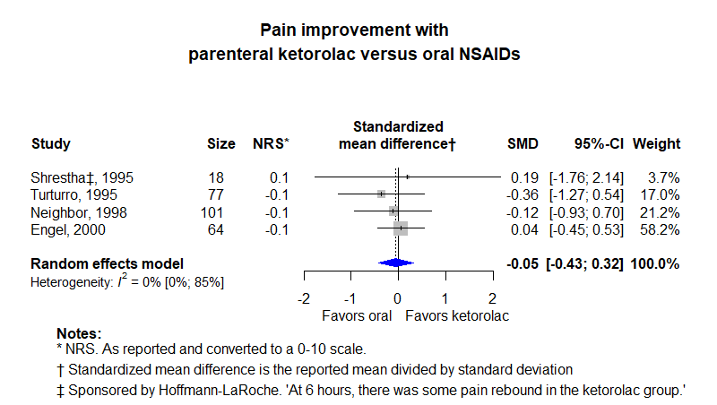

Among patients with acute pain who can take oral medications, does parenteral ketorolac reduce pain more or faster than oral NSAIDs
============================================
A living systematic review

Short url: [https://openmetaanalysis.github.io/pain-ketorolac](https://openmetaanalysis.github.io/pain-ketorolac)

**Clinical summary:** This meta-analysis suggests that parenteral ketorolac *is not* effective. Heterogeneity of results as measured by I2 was '[low](https://training.cochrane.org/handbook/current/chapter-10#section-10-10-2)' at 0%, but the confidence intervals were very wide.
<!--
Meta-regression of common modulators (year of publication, study size, event rate in the control groups) finds that the outcome of the intervention is effected by xx.

* [Reconciliation of studies and conclusions with prior meta-analyses](files/reconciliation-tables/Reconciliation%20of%20studies%20and%20conclusions.pdf)
* [Keep current with this topic](files/searching/Keep-up.md)

Acknowledgment: we acknowledge the essential work by the authors of the prior [systematic review(s)](#systematic-reviews) listed below.
-->

**Methods overview:** This repository is an [openMetaAnalysis](https://openmetaanalysis.github.io/) that combines methods of scoping, rapid, and living systematic reviews.  This analysis updates one or more previously published review(s) below (none found). <!-- A comparison of studies included in this review compared to prior reviews are in the table, [reconciliation of trials included with prior meta-analyses/](files/reconciliation-tables/Reconciliation%20of%20studies.pdf).--> Newer studies included are listed in the references below. Rationales for newer trials excluded may be listed at the end of the references. 
* [Methods](http://openmetaanalysis.github.io/methods.html) for openMetaAnalysis
* [Evidence search](files/searching/evidence-search.md) for this review (under construction)

**Results:** Details of the studies included are in the:
<!--
* [Reconciliation of studies and conclusions with prior meta-analyses](files/reconciliation-tables/Reconciliation%20of%20studies%20and%20conclusions.pdf) (under construction)
* [Description of studies (PICO table)](files/study-details/table-pico.pdf) (under construction)
* [Risk of bias assessment](files/study-details/table-bias.pdf) (under construction)
-->
* [Forest plots](../master/files/forest-plots) ([spreadsheets with source data](files/data))
<!--
* [Network plots](../master/files/network) (optional)
-->

The forest plot for the primary outcomes are below. Additional [forest plots](files/forest-plots) of secondary analyses may be available. 

<!--
The meta-regression for the primary outcomes are below. Additional [meta-regressions](files/metaregression) of secondary analyses may be available. 

The GRADE Profile is below. 
-->

References:
----------------------------------

### Systematic review(s)
#### Most recent review at time of last revision of this repository
None found

### Randomized controlled trials
#### New trial(s) *not* included in the most recent review above
1. Turturro MA, Paris PM, Seaberg DC. Intramuscular ketorolac versus oral ibuprofen in acute musculoskeletal pain. Ann Emerg Med. 1995 Aug;26(2):117-20. doi: [10.1016/s0196-0644(95)70138-9](http://dx.doi.org/10.1016/s0196-0644(95)70138-9). PMID: [7618770](http://pubmed.gov/7618770).
2. Shrestha M, Morgan DL, Moreden JM, Singh R, Nelson M, Hayes JE. Randomized double-blind comparison of the analgesic efficacy of intramuscular ketorolac and oral indomethacin in the treatment of acute gouty arthritis. Ann Emerg Med. 1995 Dec;26(6):682-6. doi: [10.1016/s0196-0644(95)70037-4](http://dx.doi.org/10.1016/s0196-0644(95)70037-4). PMID: [7492036](http://pubmed.gov/7492036).
3. Neighbor ML, Puntillo KA. Intramuscular ketorolac vs oral ibuprofen in emergency department patients with acute pain. Acad Emerg Med. 1998 Feb;5(2):118-22. doi: [10.1111/j.1553-2712.1998.tb02595.x](http://doi.org/10.1111/j.1553-2712.1998.tb02595.x). PMID: [9492131](http://pubmed.gov/9492131).
4. Engel ER, Cheng J. IM ketorolac vs diclofenac potassium powder for oral solution for the acute treatment of severe migraine: a randomized controlled trial. Neurol Sci. 2020 Mar;41(3):537-542. doi: [10.1007/s10072-019-04157-y](http://dx.doi.org/10.1007/s10072-019-04157-y). Epub 2019 Dec 12. PMID: [31833000](http://pubmed.gov/31833000).

#### Trial(s) included in the review above
NA

#### Trial(s) undergoing review
None

#### Trial(s) excluded - selected list of important trial(s)
1. Wright JM, Price SD, Watson WA. NSAID use and efficacy in the emergency department: single doses of oral ibuprofen versus intramuscular ketorolac. Ann Pharmacother. 1994 Mar;28(3):309-12. doi: 10.1177/106002809402800301. PMID: [8193414](http://pubmed.gov/8193414). *Not randomized*

#### Cited by
This repository is cited by:

1. WikiDoc contributors. Pending content page. WikiDoc. Nov 9, 2014. Available at: http://www.wikidoc.org/index.php/This_topic. Accessed November 9, 2014. 

-------------------------------
[Cite and use this content](https://github.com/openMetaAnalysis/openMetaAnalysis.github.io/blob/master/reusing.MD)  - [Edit this page](../../edit/master/README.md) - [License](files/LICENSE.md) - [History](../../commits/master/README.md)  - 
[Issues and comments](../../issues?q=is%3Aboth+is%3Aissue)

